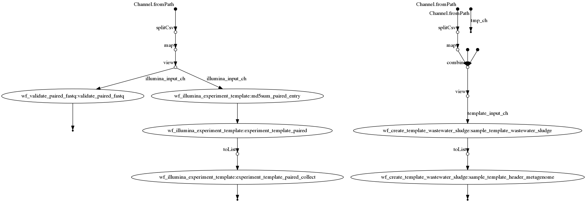

# Workflow ENA Read Upload


Maintainer: Christian & Martin

Email: christian@nanozoo.org || martin@nanozoo.org

# Whats this?

* This is a current work in progress pipeline to simplify Read uploads to ENA
* why? because its f**ing annoying if you need to handle huge files

## Supported Sample types (extending soon)

* wastewater_sludge (metagenomic samples like anaerobic digester)


# Whats it doing (TLDR)?

* it creates a super simple input form to fill
* you give him your reads you want to upload
* it creates the template experiment and template run for your upload


# Normal Installation

**Dependencies**

>   * docker (add docker to your Usergroup, so no sudo is needed)
>   * nextflow + java runtime 
>   * git (should be allready installed)
>   * wget (should be allready installed)
>   * tar (should be allready installed)

* Docker installation [here](https://docs.docker.com/v17.09/engine/installation/linux/docker-ce/ubuntu/#install-docker-ce)
* Nextflow installation [here](https://www.nextflow.io/)
* move or add the nextflow executable to a bin path
* add docker to ypur User group via `sudo usermod -a -G docker $USER`


# How to use it:

```bash
    Step 1: Choose a sample template, and create INPUT_FORM.txt:
       ${c_yellow}nextflow run main.nf --wastewater_sludge${c_reset} 

    Step 2: adjust the input form (located in ${params.output}/INPUT_FORM.txt)

    Step 3: create now templates for ENA by adding reads, sample type and template file:
      ${c_yellow}nextflow run main.nf --nano '*.fastq.gz' --wastewater_sludge --template ${params.output}/INPUT_FORM.txt${c_reset} 
    
    Step 4: upload reads via ${c_yellow}ftp webin.ebi.ac.uk${c_reset} 
    ${c_dim}Hint: The workflow creates "${params.output}/*_ENA_qc_check.txt" files if the fastq is corrupt.${c_reset}

    Step 5: register a PROJECT on ENA

    Step 6: "Submit sequence reads and experiments" -> "next" -> click on your project -> "next"

    Step 7: click on "Submit Completed Spreadsheet" an upload ${params.output}/sample_template.tsv -> "next"

    Step 8: click on "Oxford Nanopore" or "Two Fastq files (Paired)" -> "Upload Completed Spreadsheet"

    Step 9: check that "[Sample reference suggestions]" is correctly linking to your reads, select missing inputs. DONE
```


# Flowchart
